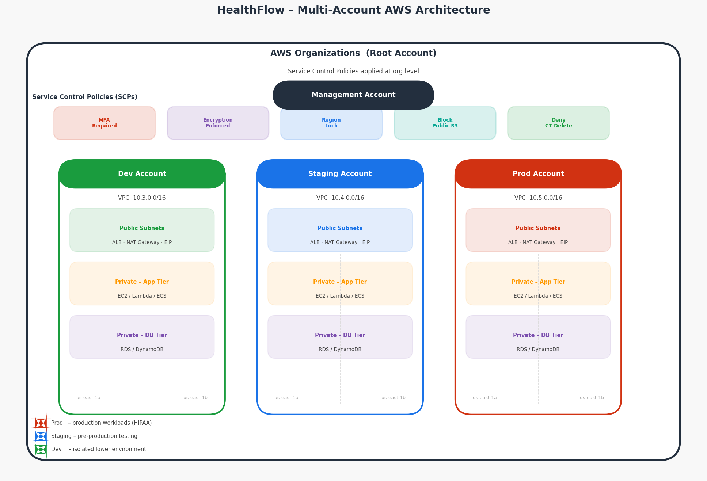
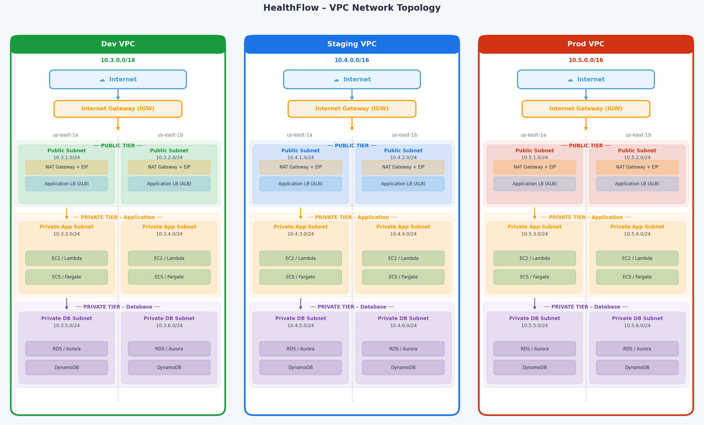
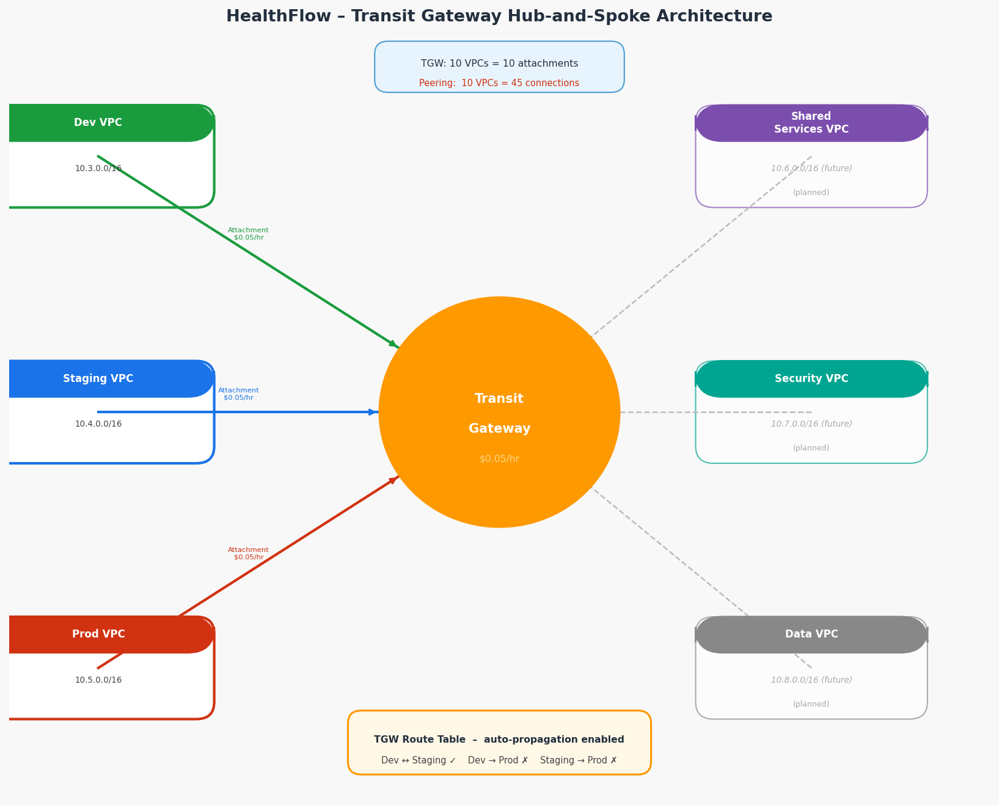
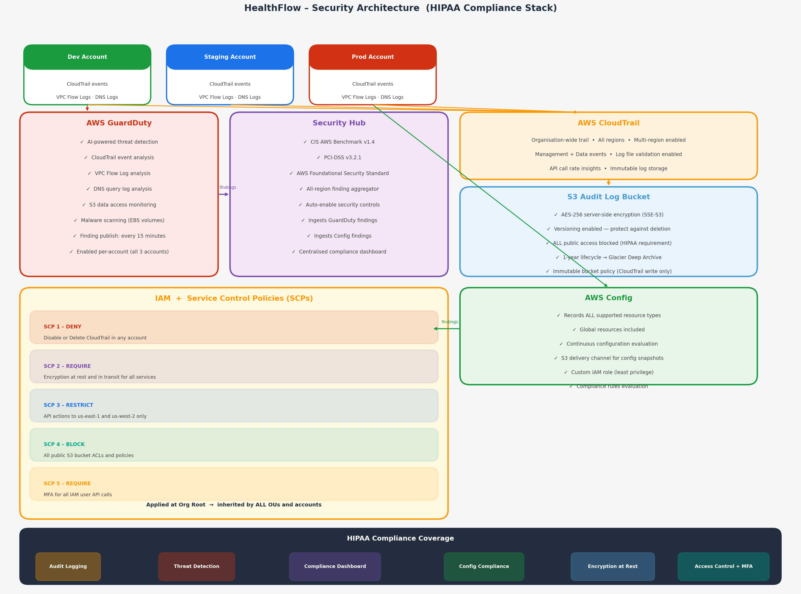
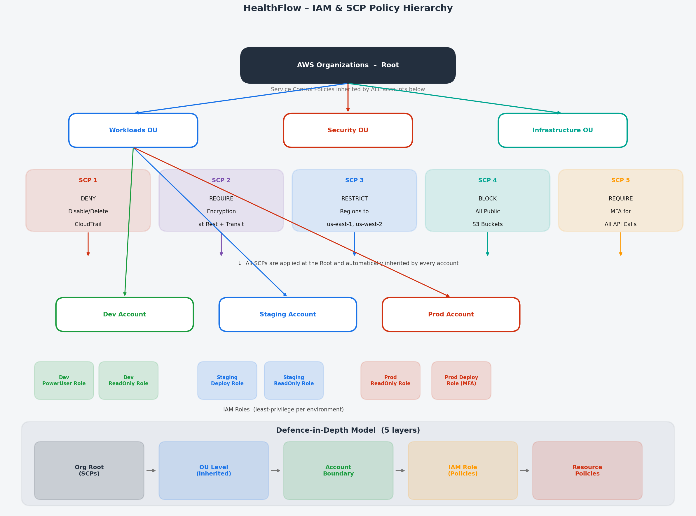
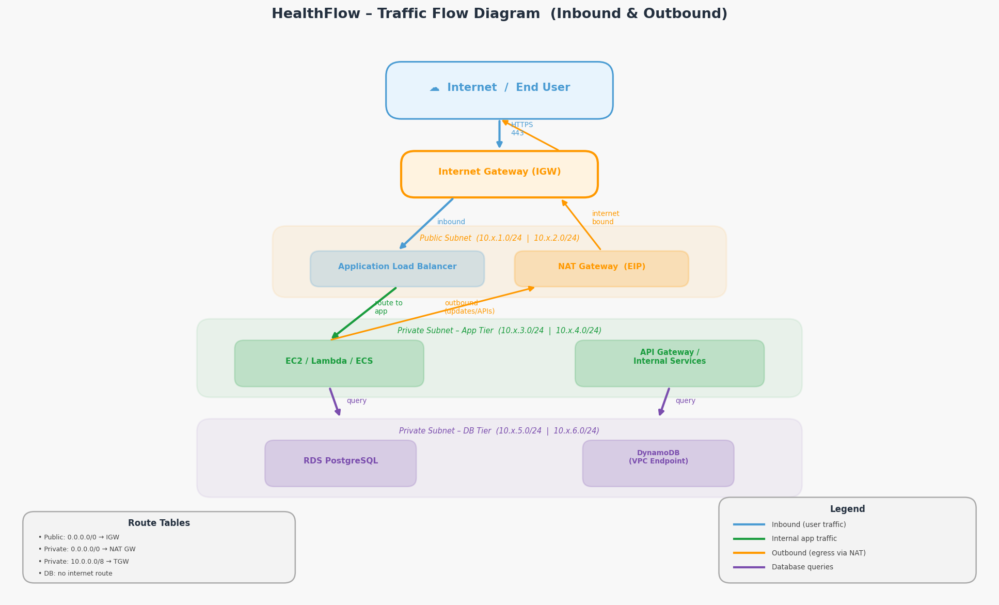

# HealthFlow AWS Landing Zone

Multi-account AWS architecture for a HIPAA-compliant healthcare SaaS platform. Built with Terraform to demonstrate Solutions Architect capabilities.

---

## Architecture Overview

- **Multi-Account Structure**: Separate Dev, Staging, and Production accounts for security isolation
- **Network Design**: VPC per account with public/private subnet architecture across 2 availability zones
- **High Availability**: Resources distributed across us-east-1a and us-east-1b
- **Security**: Private subnets by default, NAT Gateway for outbound traffic, Internet Gateway for load balancers only

---

## Architecture Diagrams

### 1. Multi-Account Architecture Overview
> AWS Organizations structure with account isolation, SCPs, and VPC layout per environment.



---

### 2. Network Topology
> VPC structure showing public/private subnet tiers, NAT Gateways, Internet Gateways, and AZ distribution.



---

### 3. Transit Gateway Hub-and-Spoke
> Central Transit Gateway connecting Dev, Staging, and Prod VPCs with planned future accounts.



---

### 4. Security Architecture (HIPAA Stack)
> CloudTrail → S3, GuardDuty → Security Hub pipeline with CIS Benchmark and PCI-DSS compliance.



---

### 5. IAM & SCP Policy Hierarchy
> Organizations root → OUs → accounts with 5 SCPs enforcing defence-in-depth security.



---

### 6. Traffic Flow (Inbound & Outbound)
> End-user → IGW → ALB → App tier → DB tier, with outbound egress through NAT Gateway.



---

### 7. Terraform Module Structure
> Module dependencies, state isolation, deployment order, and shared configuration.


---

## Infrastructure Components

### Networking (`terraform/networking/`)
- 3 VPCs (Dev: 10.3.0.0/16, Staging: 10.4.0.0/16, Prod: 10.5.0.0/16)
- Public subnets for load balancers and NAT Gateways
- Private subnets for application and database tiers
- Route tables with proper traffic segregation
- High availability across 2 availability zones per VPC

### Security (`terraform/security/`)
- **CloudTrail**: Organization-wide audit logging with 1-year retention
- **GuardDuty**: AI-powered threat detection with malware scanning
- **Security Hub**: Compliance dashboard (CIS Benchmark, PCI-DSS)
- **AWS Config**: Resource configuration tracking and compliance rules
- All logs encrypted and stored in immutable S3 buckets

### IAM (`terraform/iam/`)
- **Service Control Policies (SCPs)**: Organization-level security guardrails
  - CloudTrail protection (prevent audit log deletion)
  - Encryption enforcement (all data encrypted at rest)
  - Region restriction (us-east-1, us-west-2 only)
  - Public S3 blocking (prevent accidental exposure)
  - MFA requirement (all users must use multi-factor auth)
- Defense-in-depth security model with explicit deny policies

### Transit Gateway (`terraform/transit-gateway/`)
- **Hub-and-spoke architecture** for cross-account connectivity
- Centralized routing (auto-propagation of VPC routes)
- Scales linearly (10 VPCs = 10 attachments vs 45 peering connections)
- DNS support for cross-account name resolution
- Ready for VPN, multi-region, and firewall inspection

### Modules (`terraform/modules/vpc/`)
- Reusable VPC module with configurable CIDR blocks
- Automatic subnet creation across availability zones
- Integrated NAT Gateway and Internet Gateway setup

---

## Cost Analysis

**Monthly Infrastructure Baseline: ~$818**

Detailed breakdown available in [`docs/COST_ANALYSIS.md`](docs/COST_ANALYSIS.md)

| Category | Monthly Cost |
|----------|--------------|
| Networking (NAT Gateway, Transit Gateway) | $311–461 |
| Security & Compliance (CloudTrail, GuardDuty, Security Hub, Config) | $358 |
| IAM (SCPs, Identity Center) | $0 |
| Data Transfer | $65–120 |

**Budget Utilisation:** 16.4% of $5,000 monthly infrastructure budget

**Cost scales linearly:** At 10 accounts = $2,030/month (41% of budget)

---

## Design Decisions

All major architecture decisions are documented in Architecture Decision Records (ADRs):

- **Transit Gateway vs VPC Peering**: [`terraform/transit-gateway/DESIGN.md`](terraform/transit-gateway/DESIGN.md)
  - Chose Transit Gateway for operational simplicity and scalability
  - Cost analysis shows TGW cheaper than peering when including engineering labour
  - Enables future features: VPN, multi-region, centralised inspection

---

## Project Structure

```
healthflow-landing-zone/
├── docs/
│   ├── COST_ANALYSIS.md
│   └── diagrams/
│       ├── 01_multi_account_architecture.png
│       ├── 02_network_topology.png
│       ├── 03_transit_gateway.png
│       ├── 04_security_architecture.png
│       ├── 05_iam_scp_hierarchy.png
│       ├── 06_traffic_flow.png
│       └── 07_terraform_modules.png
├── terraform/
│   ├── modules/
│   │   └── vpc/                  # Reusable VPC module
│   │       ├── main.tf
│   │       ├── variables.tf
│   │       └── outputs.tf
│   ├── networking/               # VPC deployment
│   │   ├── main.tf
│   │   ├── variables.tf
│   │   └── provider.tf
│   ├── security/                 # CloudTrail, GuardDuty, Security Hub, Config
│   │   ├── main.tf
│   │   ├── variables.tf
│   │   ├── outputs.tf
│   │   └── provider.tf
│   ├── iam/                      # SCPs and IAM roles
│   │   ├── main.tf
│   │   ├── variables.tf
│   │   ├── outputs.tf
│   │   └── provider.tf
│   └── transit-gateway/          # TGW hub-and-spoke
│       ├── main.tf
│       ├── variables.tf
│       ├── outputs.tf
│       ├── provider.tf
│       └── DESIGN.md
└── README.md
```

---

## Usage

```bash
# Deployment order: IAM → Networking → Security → Transit Gateway

# 1. IAM (SCPs)
cd terraform/iam
terraform init && terraform plan && terraform apply

# 2. Networking (VPCs)
cd terraform/networking
terraform init && terraform plan && terraform apply

# 3. Security (CloudTrail, GuardDuty, etc.)
cd terraform/security
terraform init && terraform plan && terraform apply

# 4. Transit Gateway
cd terraform/transit-gateway
terraform init && terraform plan && terraform apply

# Destroy when done (to avoid costs)
terraform destroy
```

---

## AWS Services Used

| Service | Purpose |
|---------|---------|
| VPC | Network isolation per environment |
| Subnets | Public/private tier separation |
| Internet Gateway | Public internet access |
| NAT Gateway | Private subnet outbound access |
| Route Tables | Traffic routing and segregation |
| Elastic IPs | Static IPs for NAT Gateways |
| Transit Gateway | Cross-account hub-and-spoke networking |
| CloudTrail | Organisation-wide audit logging |
| GuardDuty | AI-powered threat detection |
| Security Hub | Compliance dashboard (CIS, PCI-DSS) |
| AWS Config | Resource configuration tracking |
| IAM / SCPs | Identity management and guardrails |
| S3 | Encrypted audit log storage |
| AWS Organizations | Multi-account management |

---

## Completion Status

- [x] Networking module (VPCs across 3 environments)
- [x] Security module (CloudTrail, GuardDuty, Security Hub, Config)
- [x] IAM module (Service Control Policies)
- [x] Transit Gateway for cross-account connectivity
- [x] Comprehensive cost analysis
- [x] Architecture Decision Records (ADRs)
- [x] Full architecture diagram suite (7 diagrams)

---

*This is a portfolio project demonstrating Solutions Architect skills. Not deployed to production.*
